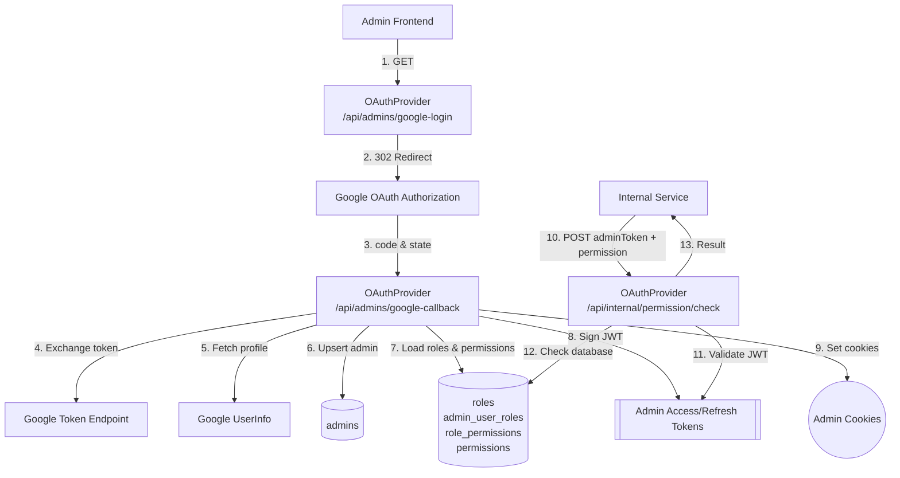

# OAuth Admin Login & Permission Check Flow

## 系統流程

> 後續每次 `check` 都會重新查詢資料庫，確保角色與權限更新即時生效。

## 資料流概覽

| 步驟 | 說明 | 輸入 | 輸出 |
| ---- | ---- | ---- | ---- |
| 1 | 前端呼叫登入 API | `project`（選填） | 302 redirect 到 Google |
| 4-5 | 兌換 Google Token | `code` | Google access token + user info |
| 6 | 管理員查詢或建立 | Google email、name | `admins` / `admin_user_roles` 可能新增 |
| 8 | 簽發 JWT | email、name、roles | Cookie: `JWT-ADMIN-...` |
| 10-13 | 權限檢查 | Admin JWT、permission | `IsAllowed` 布林值 |

## 主要資料表

### admins

| 欄位 | 型別 / 說明 |
| ---- | ---- |
| `id` | BIGINT UNSIGNED, PK |
| `uuid` | VARCHAR(255), 唯一識別碼 |
| `email` | VARCHAR(255), UNIQUE, Google 帳號 |
| `name` | VARCHAR(50), 顯示名稱 |
| `created_at` | TIMESTAMP, 建立時間 |
| `updated_at` | TIMESTAMP, 最後更新時間 |
| `deleted_at` | TIMESTAMP, 邏輯刪除時間 |

### roles

| 欄位 | 型別 / 說明 |
| ---- | ---- |
| `id` | BIGINT UNSIGNED, PK |
| `role_name` | VARCHAR(50), UNIQUE，例如 `Logistic_RD` |
| `role_info` | VARCHAR(50), 角色描述 |
| `guard_name` | VARCHAR(255), 權限領域（管理員固定 `admin`） |
| `created_at` / `updated_at` | TIMESTAMP |

### permissions

| 欄位 | 型別 / 說明 |
| ---- | ---- |
| `id` | BIGINT UNSIGNED, PK |
| `name` | VARCHAR(255), UNIQUE，例如 `logistic.schedule-execute-log.read` |
| `guard_name` | VARCHAR(255), 權限領域（管理員固定 `admin`） |
| `created_at` / `updated_at` | TIMESTAMP |

### admin_user_roles

| 欄位 | 型別 / 說明 |
| ---- | ---- |
| `role_id` | BIGINT UNSIGNED, PK / FK(`roles.id`) |
| `admin_id` | BIGINT UNSIGNED, PK / FK(`admins.id`) |
| `created_at` | TIMESTAMP, 加入角色時間 |

### role_permissions

| 欄位 | 型別 / 說明 |
| ---- | ---- |
| `role_id` | BIGINT UNSIGNED, PK / FK(`roles.id`) |
| `permission_id` | BIGINT UNSIGNED, PK / FK(`permissions.id`) |

## 權限驗證邏輯

1. 內部系統呼叫 `/api/internal/permission/check`，帶入 Admin JWT 與權限名稱。
2. `PermissionController` 使用 `_jwtHelper.ValidateToken` 解析 JWT，取得 `ClaimsPrincipal`。
3. `PermissionAuthorizationHandler` 讀取 `ClaimTypes.Email`，呼叫 `_adminService.CheckPermission`：
   - 透過 `admins` 找出管理員。
   - 載入角色與權限 (`roles`、`admin_user_roles`、`role_permissions`、`permissions`)。
   - 任一角色含有目標權限即通過。
4. 回傳 `IsAllowed = true/false` 給呼叫方。

> JWT 只內含 `email`、`name`、`roles`（逗號字串），最終判斷仍以資料庫權限為準。

## Kevin 的預設資料

| 項目 | 值 |
| ---- | ---- |
| 管理員 Email | `kevin@paynow.com.tw` |
| 預設角色 | `Logistic_RD` |
| 測試權限 | `logistic.schedule-execute-log.read` |
| JWT Cookie 名稱 | `JWT-ADMIN-LOCAL-ACCESS-TOKEN` / `JWT-ADMIN-LOCAL-REFRESH-TOKEN` |

---
_Last updated: 2025-10-02_
